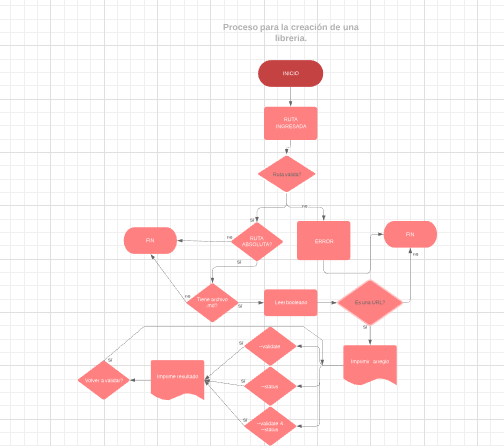

# Markdown Links Check


## Preámbulo

[Markdown](https://es.wikipedia.org/wiki/Markdown) es un lenguaje de marcado
ligero muy popular entre developers. Es usado en muchísimas plataformas que
manejan texto plano (GitHub, foros, blogs, ...), y es muy común
encontrar varios archivos en ese formato en cualquier tipo de repositorio
(empezando por el tradicional `README.md`).

Estos archivos `Markdown` normalmente contienen _links_ (vínculos/ligas) que
muchas veces están rotos o ya no son válidos y eso perjudica mucho el valor de
la información que se quiere compartir.

Dentro de una comunidad de código abierto, nos han propuesto crear una
herramienta usando [Node.js](https://nodejs.org/), que lea y analice archivos
en formato `Markdown`, para verificar los links que contengan y reportar
algunas estadísticas.


Ejemplo del flujo que lleva nuestra librería



## Requerimientos previos
  * node.js

## Tópicos
- [Node.js](https://nodejs.org/en/).
- [file system](https://nodejs.org/api/fs.html).
- [path](https://nodejs.org/api/path.html).

## Librerías utilizadas
  * fs
  * path
  * chalk
  * node-fetch

## Lenguaje utilizado
El código está escrito en lenguaje de javascript.

## Instalación    

Para agregar el modulo a tú proyecto, instala:

#### `npm install npm i iris-md-links`

## Uso
#### `md-links(path, options)`

##### Argumentos

- `path`: Ruta absoluta o relativa al archivo o directorio. Si la ruta pasada es
  relativa, debe resolverse con respecto al directorio desde donde se invoca
  node (_current working directory_).
- `options`: Un objeto con las siguientes propiedades:
  - `validate`: Booleano que determina si se desea validar los links
    encontrados.

Para poder extraer los archivos de un archivo específico ejecuta el siguiente comando
Comando "md-links" + la ruta de tu archivo
md-links ejemplo.md

Opciones:
Si deseas validar los link y/o ver sus estadisticas ejecuta el siguiente comando

#### `--validate` (Verifica si el link funciona o no. Si el link resulta en una redirección a una URL el link se considerará como  ✔ OK  en caso contrario ✖ error, not found)
#### `--stats` (Será un texto con estadísticas básicas sobre los links)
#### `--validate--stast` (Para obtener estadísticas que necesiten de los resultados de la validación)

Ejemplo:
#### `md-links ejemplo.md --validate`
```sh
$ md-links ejemplo.md --validate
Title: algo
Link: http://algo.com/2/3/ ok 200 Link a algo
File found: ejemplo.md
Response code: ✔ 200
Response: OK
```
#### `md-links ejemplo.md --stats`
```sh
$ md-links ejemplo.md --stats
File name: ejemplo.md
Total Links: 20
Total  unique Links: 20
```

#### `md-links ejemplo.md --validate--stast`
```sh
$ md-links ejemplo.md --stats
Title: algo
Link: http://algo.com/2/3/ ok 200 Link a algo
File found: ejemplo.md
Response code: ✔ 200
Response: OK

File name: ejemplo.md
Total Links: 20
Total  unique Links: 20
```

## Versión  
Version: 0.1.0

## Autor 
Iris Aguiar